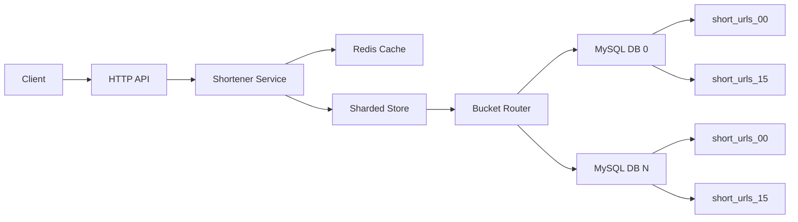
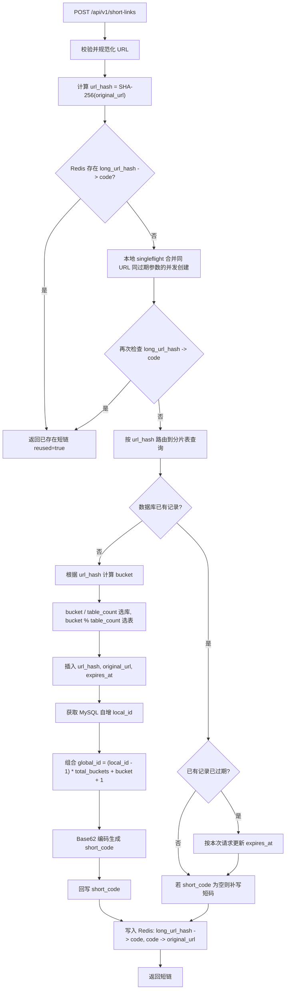
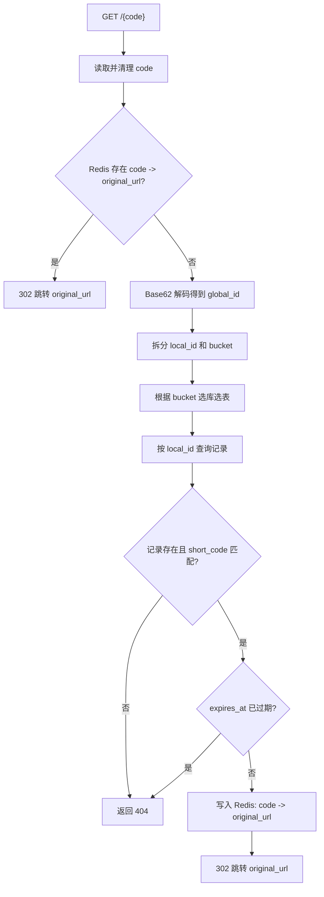
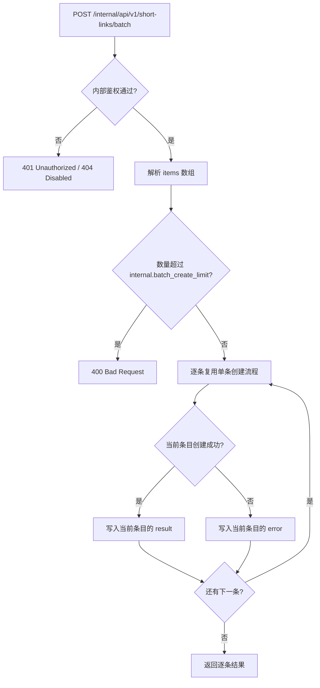
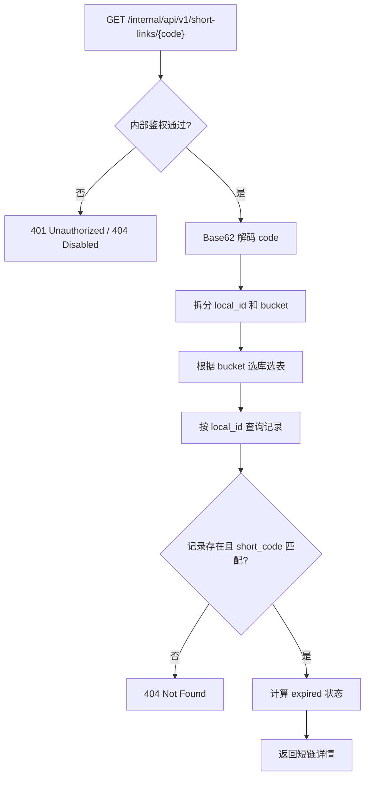

# Short URL

Go 短链服务，支持 MySQL 分库分表、数据库自增 ID 唯一性、Base62 压缩短码，以及 Redis 缓存来降低重复生成和重定向读压力。

## 核心设计

- 写入路由：对原始 URL 做 SHA-256，再用 FNV 哈希映射到一个全局 bucket。
- 分库分表：`bucket / table_count` 选择数据库，`bucket % table_count` 选择表，例如 `short_urls_03`。
- 唯一 ID：每个物理表使用 MySQL 自增 ID。服务把 `local_id + bucket` 组合成全局数字 ID：`global_id = (local_id - 1) * total_buckets + bucket + 1`。
- 短码生成：对 `global_id` 做 Base62 编码。解析短码时可反解出 bucket 和 local ID，直接命中对应库表。
- 去重与缓存：Redis 缓存 `long_url_hash -> code` 和 `code -> original_url`；服务内用本地 singleflight 合并同一实例上的重复创建请求；数据库层用 `url_hash` 唯一索引保证同一个 URL 只创建一条记录，并作为跨实例并发去重兜底。
- 过期复用：同一个 URL 已过期后再次创建时，复用原短码并更新 `expires_at`，避免 `url_hash` 唯一索引导致过期链接无法重新启用。

## 完整流程图

整体架构：



创建短链：



访问短链：



内部批量创建短链：



内部查询短链：



## 表结构设计

当前部署脚本会创建一个逻辑库 `short_url_0`，并在库内创建 16 张同构分表：

```sql
CREATE DATABASE IF NOT EXISTS short_url_0 DEFAULT CHARACTER SET utf8mb4 COLLATE utf8mb4_unicode_ci;
USE short_url_0;

CREATE TABLE IF NOT EXISTS short_urls_00 (
  id BIGINT UNSIGNED NOT NULL AUTO_INCREMENT,
  url_hash CHAR(64) NOT NULL,
  short_code VARCHAR(32) NOT NULL DEFAULT '',
  original_url TEXT NOT NULL,
  expires_at DATETIME NULL,
  created_at DATETIME NOT NULL DEFAULT CURRENT_TIMESTAMP,
  updated_at DATETIME NOT NULL DEFAULT CURRENT_TIMESTAMP ON UPDATE CURRENT_TIMESTAMP,
  PRIMARY KEY (id),
  UNIQUE KEY uk_url_hash (url_hash),
  KEY idx_expires_at (expires_at)
) ENGINE=InnoDB DEFAULT CHARSET=utf8mb4 COLLATE=utf8mb4_unicode_ci;
```

其余分表通过 `LIKE short_urls_00` 创建：

```sql
CREATE TABLE IF NOT EXISTS short_urls_01 LIKE short_urls_00;
CREATE TABLE IF NOT EXISTS short_urls_02 LIKE short_urls_00;
...
CREATE TABLE IF NOT EXISTS short_urls_15 LIKE short_urls_00;
```

字段说明：

| 字段 | 类型 | 说明 |
| --- | --- | --- |
| `id` | `BIGINT UNSIGNED AUTO_INCREMENT` | 当前物理表内的自增 ID，也就是 `local_id`。 |
| `url_hash` | `CHAR(64)` | 原始 URL 规范化后的 SHA-256 值，用于去重和分片路由。 |
| `short_code` | `VARCHAR(32)` | Base62 短码，由 `global_id` 编码生成。初始插入后再回写。 |
| `original_url` | `TEXT` | 规范化后的原始长链接。 |
| `expires_at` | `DATETIME NULL` | 过期时间，为空表示不过期。 |
| `created_at` | `DATETIME` | 创建时间。 |
| `updated_at` | `DATETIME` | 更新时间，记录变更时自动刷新。 |

索引设计：

| 索引 | 字段 | 作用 |
| --- | --- | --- |
| `PRIMARY KEY` | `id` | 支持通过短码反解出的 `local_id` 直接定位记录。 |
| `uk_url_hash` | `url_hash` | 保证同一个长链接只创建一条记录，并作为并发去重兜底。 |
| `idx_expires_at` | `expires_at` | 支持后续按过期时间清理或扫描过期短链。 |

分片关系：

```text
total_buckets = db_count * table_count
bucket = fnv32a(url_hash) % total_buckets
db_index = bucket / table_count
table_index = bucket % table_count
table_name = short_urls_%02d(table_index)
```

短码和主键关系：

```text
global_id = (local_id - 1) * total_buckets + bucket + 1
short_code = base62(global_id)
```

访问短链时会反向执行：

```text
global_id = base62_decode(short_code)
local_id, bucket = split(global_id, total_buckets)
```

## API

创建短链：

```bash
curl -X POST http://localhost:8080/api/v1/short-links \
  -H 'content-type: application/json' \
  -d '{"url":"https://example.com/a/very/long/path","expire_in":"24h"}'
```

响应：

```json
{
  "code": "1B",
  "short_url": "http://localhost:8080/1B",
  "url": "https://example.com/a/very/long/path",
  "reused": false
}
```

访问短链：

```bash
curl -I http://localhost:8080/1B
```

健康检查：

```bash
curl http://localhost:8080/healthz
```

内部接口鉴权由配置文件里的 `internal.auth_mode` 决定：

| 模式 | 说明 |
| --- | --- |
| `disabled` | 内部接口关闭，返回 404。 |
| `none` | 不鉴权，适合只暴露在可信内网的场景。 |
| `bearer` | 使用 `Authorization: Bearer <token>`。 |
| `header` | 使用 `internal.auth_header` 指定的请求头。 |
| `any` | 同时支持 Bearer 和自定义 Header。 |

未显式配置 `auth_mode` 时，如果 `api_token` 为空，内部接口默认关闭；如果 `api_token` 非空，默认使用 `any`。

批量创建短链：

```bash
curl -X POST http://localhost:8080/internal/api/v1/short-links/batch \
  -H 'authorization: Bearer change-me' \
  -H 'content-type: application/json' \
  -d '{
    "items": [
      {"url": "https://example.com/a", "expire_in": "24h"},
      {"url": "https://example.com/b", "expire_at": "2026-12-31T23:59:59Z"}
    ]
  }'
```

响应会按输入顺序返回逐条结果；单条失败不会影响其他条目：

```json
{
  "results": [
    {
      "index": 0,
      "ok": true,
      "result": {
        "code": "1B",
        "short_url": "http://localhost:8080/1B",
        "url": "https://example.com/a",
        "reused": false
      }
    },
    {
      "index": 1,
      "ok": false,
      "error": "url must be absolute"
    }
  ]
}
```

查询短链详情：

```bash
curl http://localhost:8080/internal/api/v1/short-links/1B \
  -H 'authorization: Bearer change-me'
```

响应：

```json
{
  "id": 123,
  "bucket": 7,
  "code": "1B",
  "short_url": "http://localhost:8080/1B",
  "url": "https://example.com/a",
  "created_at": "2026-05-24T10:00:00Z",
  "updated_at": "2026-05-24T10:00:00Z",
  "expired": false
}
```

## 本地运行

1. 创建数据库并执行 `deploy/schema.sql`。
2. 复制 `config.example.toml` 为 `config.toml`，并按实际 MySQL/Redis 调整。
3. 启动服务：

```bash
go run ./cmd/api -config config.toml
```

Redis 可选；配置文件里不设置 `redis.addr` 时，服务仍会通过 MySQL 唯一索引保证正确性。

配置文件也可以只作为配置中心引导文件。例如从 HTTP 配置中心加载完整 TOML 配置：

```toml
[config_source]
type = "http"
url = "https://config.example.com/short-url/prod.toml"
token = "config-center-token"
```

也可以从另一个本地 TOML 文件加载：

```toml
[config_source]
type = "file"
path = "/etc/short-url/runtime.toml"
```

## 扩容说明

初始上线后不要随意修改 `mysql.table_count` 或数据库分片数量，因为短码反解依赖 `total_buckets = db_count * table_count`。如果需要扩容，建议使用版本化短码空间或新增集群前缀来迁移。
